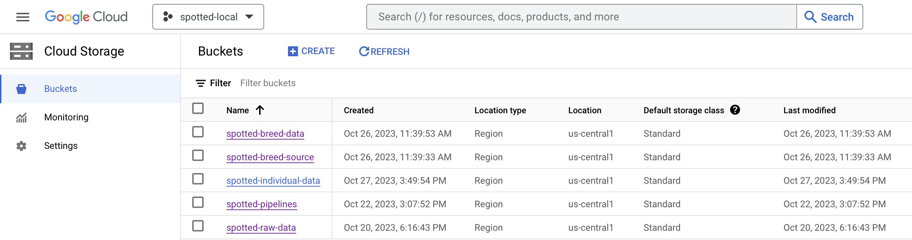

GCS Data Organization
---------------------

    .
    ├── spotted-raw-data
    │   ├── austin   <- Austin Pets Alive (individual data)
    │   │   ├── annotations/
    │   │   └── full_quality/ 
    │   ├── stanford   <- Stanford Dogs (breed data)
    │   │   ├── Annotation
    │   │   └── Images
    │   └── tsinghua   <- Tsinghua Dogs (breed data)
    │       ├── low_resolution
    │       └── Low_Annotations
    │   
    ├── spotted-breed-source  <- Transformed breed data
    │   ├── images (All breed images padded to squares)
    │   ├── annotations (Annotations standardized and converted to JSON)
    │   └── cropped (Images cropped by bounding box and padded to squares)
    │   
    ├── spotted-breed-data 
    │   ├── 224/ <- Datasets sorted by size
    │   │   ├── csv (Training splits for breed data)
    │   │   │   ├── all-data.csv (All image filenames and breed labels)
    │   │   │   ├── train.csv
    │   │   │   ├── val.csv
    │   │   │   └── test.csv
    │   │   ├── preprocessed
    │   │   │   ├── images (Uncropped, resized breed images)
    │   │   │   │   ├── train/
    │   │   │   │   ├── val/
    │   │   │   │   └── test/
    │   │   │   └── cropped (Cropped, resized breed images)
    │   │   │       ├── train/
    │   │   │       ├── val/
    │   │   │       └── test/
    │   │   └── processed
    │   │       ├── images/ (Uncropped breed TFRecord files)
    │   │       │   └── dvc_store/
    │   │       └─── cropped/ (Cropped breed TFRecord files)
    │   │           └── dvc_store/
    │   └── <Other Image Sizes> 
    │   
    ├── spotted-individual-data 
    │   ├── 224/ <- Datasets sorted by size
    │   │   └── processed 
    │   │        └── dvc_store/     
    │   └── <Other Image Sizes> 
    │  
    └── spotted-pipelines  <- Staging and output for Vertex AI Pipelines

