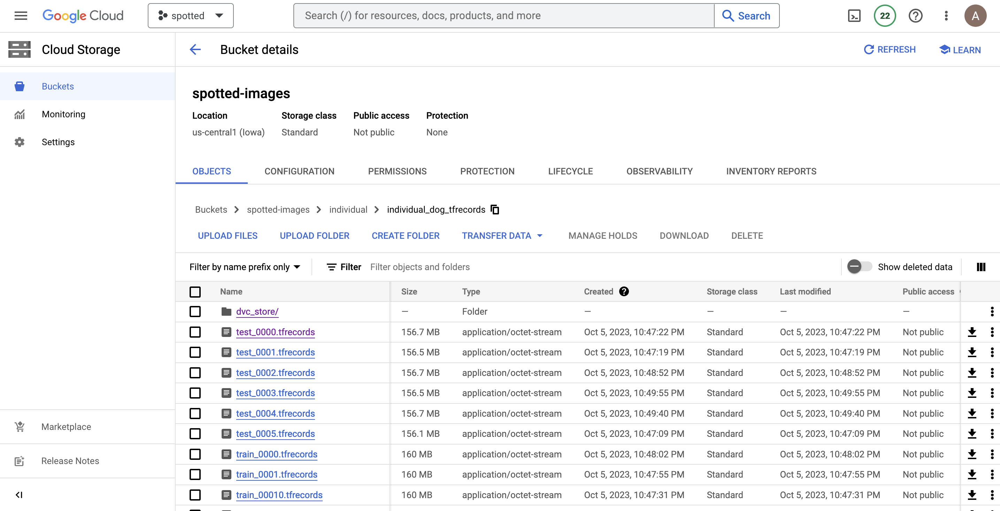
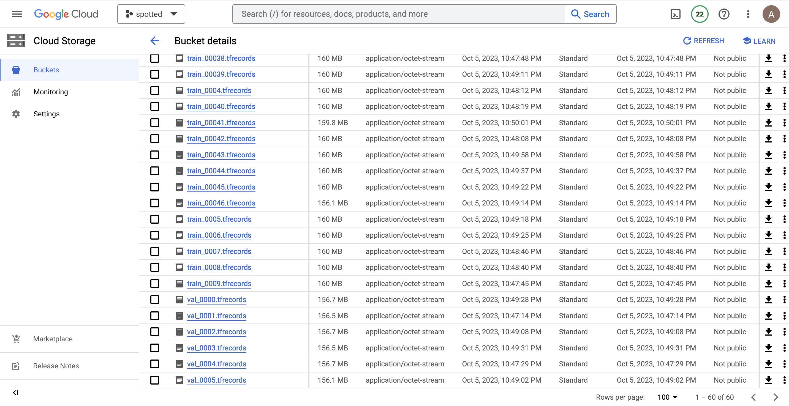

In order to avoid loading data files to github, we prepared this structure to keep the buckets sorted out. 

Processed data is in the following buckets:

https://console.cloud.google.com/storage/browser/spotted-images/individual/individual_dog_tfrecords?pageState=(%22StorageObjectListTable%22:(%22f%22:%22%255B%255D%22)  
 

