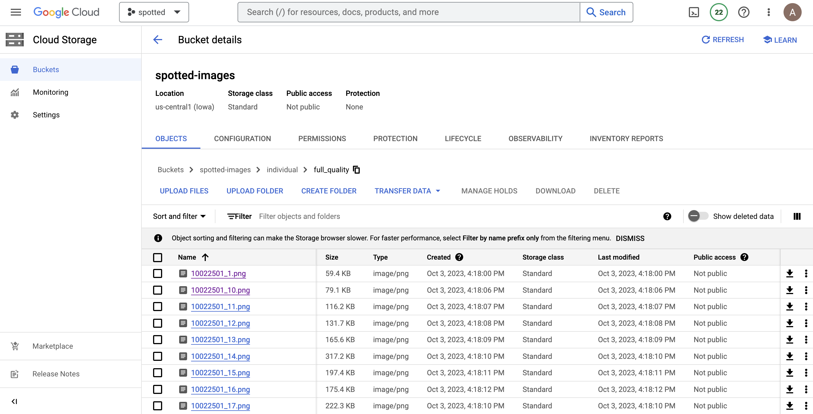
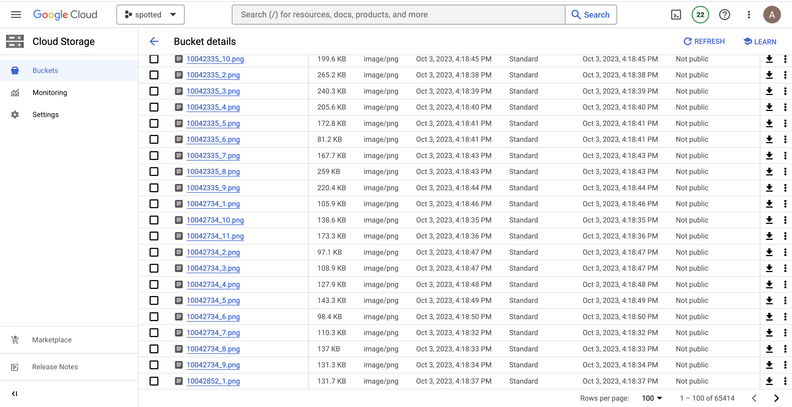

In order to avoid loading data files to github, we prepared this structure to keep the buckets sorted out. 

Original data is in the following buckets:

stanford-dogs-original https://console.cloud.google.com/storage/browser/stanford-dogs-original;tab=objects?forceOnBucketsSortingFiltering=true&project=spotted-399806&prefix=&forceOnObjectsSortingFiltering=false

oxford-pets-original https://console.cloud.google.com/storage/browser/oxford-pets-original;tab=objects?forceOnBucketsSortingFiltering=true&project=spotted-399806&prefix=&forceOnObjectsSortingFiltering=false 
    
dog-breeds-original https://console.cloud.google.com/storage/browser/dog-breeds-original;tab=objects?forceOnBucketsSortingFiltering=true&project=spotted-399806&prefix=&forceOnObjectsSortingFiltering=false 

austin-pets-alive-original https://console.cloud.google.com/storage/browser/spotted-images/individual/full_quality?pageState=(%22StorageObjectListTable%22:(%22f%22:%22%255B%255D%22)

Links to the datasources online:

1. Stanford Dogs dataset: https://www.tensorflow.org/datasets/catalog/stanford_dogs

2. Oxford-IIIT pet dataset: https://www.tensorflow.org/datasets/catalog/oxford_iiit_pet

3. Austin Pets Alive (AC215 - 2021). https://github.com/yuxinxu77/AC215_DataPets

4. Petfinder dataset: https://www.tensorflow.org/datasets/catalog/pet_finder  

