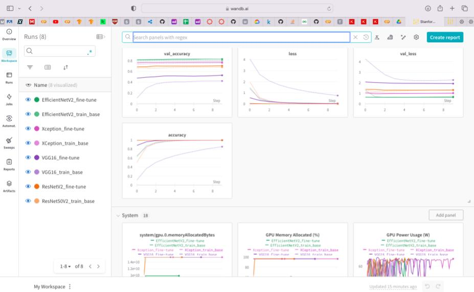
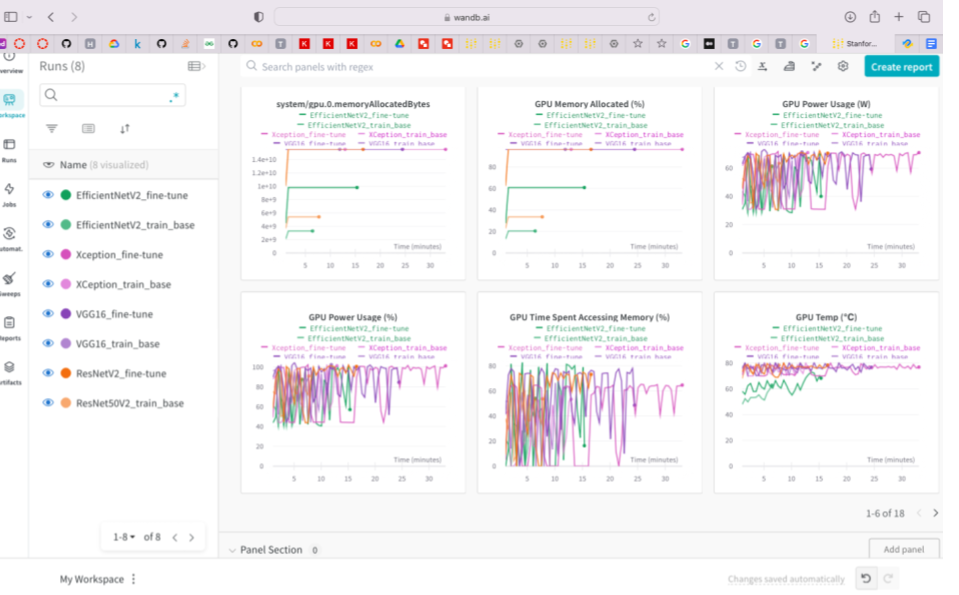

AC215-Milestone 3 submission SPOTTED!
==============================

Project Organization
------------

    .
    ├── data  <- Representation of our data organization (no data stored, all on GCS)
    │   ├── interim     <- Intermediate preprocessed data
    │   ├── processed   <- TFRecords dataset files for model training
    │   └── raw         <- Original source data
    ├── notebooks  <- Jupyter notebooks for EDA and model testing (run on Colab or container)
    │   ├── Dockerfile
    │   ├── eda_and_baseline_model.ipynb
    │   ├── models_train_wandb.ipynb
    │   ├── Pipfile
    │   ├── Pipfile.lock
    │   └── setup.sh
    ├── references  <- Reference materials/papers
    ├── reports  <- Folder containing past milestone submissions and images
    │   ├── screenshots/
    │   ├── milestone1.md
    │   └── milestone2.md         
    ├── src  <- Source code and Dockerfiles for data processing and modeling
    │   ├── austin_dogs_data_download  <- Containerized upload of Austin dogs dataset to GCP
    │   │   ├── cli.py
    │   │   ├── Dockerfile
    │   │   ├── dogs_photos.csv
    │   │   ├── dogs.csv
    │   │   ├── Pipfile
    │   │   ├── Pipfile.lock
    │   │   └── README.md
    │   ├── austin_dogs_tensorflow_records  <- Container that creates tensorflow records for Austin dog dataset
    │   │   ├── cli.py
    │   │   ├── Dockerfile
    │   │   ├── Pipfile
    │   │   ├── Pipfile.lock    
    │   │   └── README.md
    │   ├── data_pipeline   <- Container for data pipeline managing dog breed image data
    │   │   ├── data-extraction.py
    │   │   ├── data-processing.py
    │   │   ├── data-preprocessing.py
    │   │   ├── data-transformation.py
    │   │   ├── Dockerfile
    │   │   ├── Pipfile
    │   │   ├── Pipfile.lock
    │   │   ├── README.md
    │   │   └── setup.sh
    │   ├── data_versioning  <- Data versioning container using DVC
    │   │   ├── docker-entrypoint.sh
    │   │   ├── docker-shell.sh
    │   │   ├── Dockerfile
    │   │   ├── Pipfile
    │   │   ├── Pipfile.lock
    │   │   ├── dvc-data.dvc
    │   │   └── README.md
    │   └── matching  <- FAISS and ViTMAE matching model testing
    │       ├── notebooks/
    │       │     ├── faiss.ipynb
    │       │     └── image_encoder.ipynb
    │       ├── src/
    │       │     ├── faiss_tutorial.py
    │       │     └── vit_mae_encoder.py
    │       ├── Dockerfile
    │       └── README.md
    └── README.md

--------

# AC215 - Milestone 3 - SPOTTED!

**Team Members**  
Sunil Chomal, Alex Coward, Olga Leushina, and Jonathan Sessa

**Group Name**  
Spotted!

**Project**  
Our project seeks to identify lost dogs from images uploaded by spotters and find potential matches among dogs reported missing by owners. To accomplish this we envision requiring two models: one to predict the breed of a dog from a given photo (to help group images and filter likely matches) and another to predict the likelihood of two images depicting the same dog.

## Milestone 3

For this milestone, we focused on expanding and improving our data pipeline and beginning our model training.

Our project uses two types of image data: dog breed data and individual dog data (where the same dog is shown in multiple photos). Our dog breed data is managed by a comprehensive pipeline which handles extraction, transformation, preprocessing, and processing all from a single command line, while our individual dog data is managed by two containers: one for data extraction and one for data transformation and processing to TFRecords. Our containers are all Dockerized to run on Google Cloud VMs and all our data is now stored in Google Cloud Storage (GCS).

Our improved workflow makes it easier and faster to incorporate additional data into our data set. We have begun adding multi-threading to our pipeline and seen our data preprocessing speeds improve 6.5x over our previous version. We expanded our dog breed dataset by adding the Oxford Pets dataset (~5,000 images) and plan to introduce more images for both types of data in the future. We have also incorporated Data Version Control (DVC) into our workflow to track our TFRecords data so any future changes to our data will be versionized and captured on our Git repository.

Regarding the modeling process, our GPU request is not yet approved by Google. Our training script/notebooks are designed so that we could pass in the arguments defining the number of GPUs to use. To get this to work within the Docker container, we used CMD, which allows us to use the default single GPU training code or overwrite it should more GPUs become available. 

Our training results are quite good on the Stanford Dogs dataset, as a next step we have to combine all of the datasets and also run test using combined test dataset and real-world pictures. If the results are not satisfactory, we will have to add more data from the web using web-scraping that we developed and submitted in Milestone 2.

**Experiment Tracking**

We used Weights and Biases for analysis. As can be seen from the screenshots and from the results of test set evaluation below in the Notebooks section, the models overfit the training set and we shall try to improve performance on the test set. Next steps are to combine datasets with web-scraped pictures and create a more representative (large) dataset for the final model. The training is dependent on Google providing access to GPU as the training jobs will crash in notepad (particularly RAM usage is quite high for some of the models).

Link to report (anyone with the link can view): https://api.wandb.ai/links/spotted-dog/yo521v1h 

**Serverless Training**

Not done yet due to GPE quotas not available.

## Code Structure

**Data Storeage**

All of our data is now stored and accessed via GCS buckets. The `data` folder on our repo does not contain any data, just information (e.g., CSV files, screenshots, etc.) and links to data sources.

**Notebooks**

This folder contains 2 notebooks: EDA and baseline model and Models training notebooks as well as files necessary to run the notebooks in a container. We trained 4 models based on most popular pre-trained models and got the following results:

1. EfficientNetV2 transfer learning ----------------------  
Accuracy on test dataset:       0.82  
Base model training time:             5.95  
Final model training time:                   19.39  

2. XCeption transfer learning ----------------------------  
Accuracy on test dataset:       0.76  
Base model training time:             12.87  
Final model training time:                   33.06  

3. ResNet50V2 transfer learning --------------------------  
Accuracy on test dataset:       0.68  
Base model training time:             7.66  
Final model training time:                   16.48  

4. VGG16 transfer learning -------------------------------  
Accuracy on test dataset:       0.5  
Base model training time:             11.81  
Final model training time:                   24.37  

**Austin Dogs Data**

These containers reads 100GB of data, transforming the images to TFRecords, and stores them in a GCP bucket.

* `src/austin_dogs_data_download` - Images are downlaoded from urls in dogs_photos.csv and annotations are created from data in dogs.csv. Dask bag is used to manage processing of multiple downloads and json creations. Container is built to run on GCP VM with a GCP bucket mounted via GCS Fuse (instructions for running Dockerfile can be found [here](../src/austin_dogs_data_download/README.md)). Error handling included to deal with lack of images at some urls. Potential future improvement would be to use httpx instead of requests to process http get requests.

* `src/austin_dogs_tensorflow_records` - Container that creates tensorflow records for Austin dog dataset in GCP bucket mounted to GCP vm using GCS Fuse. Images are resized to 224x224x3 and an 80/10/10 train/val/test split is done with random_state = 215 for reproducability (instructions for running Dockerfile can be found [here](../src/austin_dogs_tensorflow_records/README.md))

**Data Pipeline (src/data_pipeline)**

The `data_pipeline` container is responsible for managing all of our dog breed image data. All functionality is managed from the CLI (instructions for running Dockerfile can be found [here](../src/data_pipeline/README.md)):

* `src/data_pipeline/data-extraction.py` - Downloads datasets from source, extracts files and upload to GCS

* `src/data_pipeline/data-transformation.py` - Extracts label data and renames files, then moves images to a pooled GCS bucket for all dog breed data

* `src/data_pipeline/data-preprocessing` - Generates our train/validation/test splits (stratifying on breed to ensure proportional representation), generates CSV files, and dynamically resizes images based on input parameter. Uses multi-threading to improve performance.

* `src/data-processing.py` - Takes the data from a preprocessed bucket and converts the data into TFRecord files.

* `src/data_pipeline/setup.sh` - Docker entrypoint which stores bucket names and environment variables, and dynamically mounts our GCS buckets using GCSFuse.

**Data Versioning (src/data_versioning)**

The `data_versioning` container stores files for configuring our Docker container for running DVC and storing necessary DVC files (instructions for running Dockerfile can be found [here](../src/data_versioning/README.md)). All DVC data files are stored in a `dvc_store` folder in the GCS data bucket.

**Matching**

Instructions for running Dockerfile can be found [here](../src/matching/README.md)

* Implements Facebook AI Similarity Search (FAISS) model for matching images
* Images are vector encoded using VIT MAE
* Will be used in our application to try and match two photos to determine if they are of the same dog

