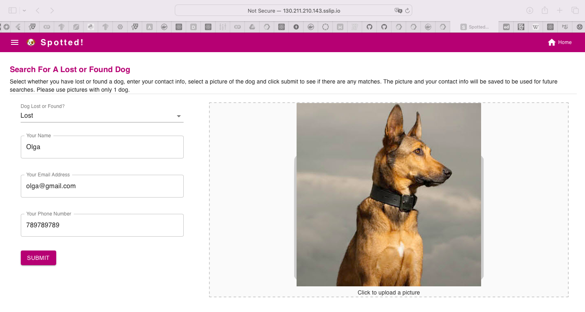
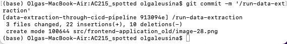

# Spotted App - Deployment & Scaling

## Prerequisites
* Have Docker installed
* Have VSCode or editor of choice

### Create a local **secrets** folder

It is important to note that we do not want any secure information in Git. So we will manage these files outside of the git folder. At the same level as the `src` folder create a folder called **secrets**

Your folder structure should look like this:
```
|-AC215_SPOTTED 	
	|-src
    	|-data_extraction
	 ...
     	|-frontend-application
       		|---api-service
       		|---deployment
	   		|---frontend-react
	...
|-secrets
|-persistent-folder
```
You need to have the following accounts with the pre-defined rights:
1. `ml-workflow`. For "Service account permissions" select "Storage Admin", "AI Platform Admin", "Vertex AI Administrator", "Service Account User" - this is needed for the prediction to work from the container using Vertex AI endpoint
2. `bucket-reader` Same rights
3. `deployment`:
    - Compute Admin
    - Compute OS Login
    - Container Registry Service Agent
    - Kubernetes Engine Admin
    - Service Account User
    - Storage Admin
4. `gcp-service`:
    - Storage Object Viewer

***NB: all accounts are created in spotted project, but the keys have to be created/downloaded/renamed accordingly.***

## 1. Build api-service image and start container

To build an image and start container we need to cd into frontend-application/api-service folder and run `sh docker-shell.sh`


To run development API service run `uvicorn_server` from the docker shell


Test the API service by going to `http://localhost:9000/`


Test that the auto-generated documents are there by going to `http://localhost:9000/docs`


## 2. Build frontend-react image and start container
To build an image and start container we need to cd into frontend-application/frontend-react folder and run `sh docker-shell.sh`

Once the container is running run `yarn start` to start React application


Go to `http://localhost:3000/` and make sure you can see the prediction page


## 3. Preparation of images on Docker Hub

1. Building and pushing images to Docker hub
If the images are changed, they need to be re-published to dockerhub. For that you need to create an account on Docker hub and create a new access token using (https://hub.docker.com/settings/security). In order to re-publish the images, the following has to be done:
1.1 In a new terminal login to the Hub `docker login -u <USER NAME> -p <ACCESS TOKEN>`
1.2 Build the images and push Docker hub:
 - in the same terminal session go to folder `api-service`, make sure you are not in the docker shell. 
    - Build and Tag the Docker Image: `docker build -t <USER NAME>/spotted-app-api-service -f Dockerfile .`
    - If you are on M1/2 Macs: Build and Tag the Docker Image: `docker build -t <USER NAME>/spotted-app-api-service --platform=linux/amd64/v2 -f Dockerfile .`
    - Push to Docker Hub: `docker push <USER NAME>/spotted-app-api-service`

 - Same thing for the `frontend-react` folder: 
    - `docker build -t <USER NAME>/spotted-app-frontend -f Dockerfile .`

    - Push to Docker Hub: `docker push <USER NAME>/spotted-app-frontend`


Result:


## 4. Deployment to GCP VM MANUALLY

1. Creation of VM instance
- Go to [GCP](https://console.cloud.google.com/compute/instances) and create a VM using default config, but:
	- Machine Type: N2D
	- Allow HTTP traffic
	- Allow HTTPS traffic

2. VM instance configuration

- SSH into your newly created instance
Install Docker on the newly created instance by running
* `curl -fsSL https://get.docker.com -o get-docker.sh`
* `sudo sh get-docker.sh`
Check version of installed Docker
* `sudo docker --version`


- Create folders and give permissions
sudo mkdir persistent-folder
sudo mkdir secrets
sudo mkdir -p conf/nginx
sudo chmod 0777 persistent-folder
sudo chmod 0777 secrets
sudo chmod -R 0777 conf


- Add secrets file
    - cd into secrets folder
    - create a file `bucket-reader.json` using the echo command:
    echo '<___Json Key downloaded from the GCP___>' > secrets/bucket-reader.json


- Create Docker network
```
sudo docker network create spotted-app
```


3. Running of containers

- Run the API container using the following command (please replace bucket name if necessary and also Docker hub reference of the image)
```
sudo docker run -d --name api-service \
-v "$(pwd)/persistent-folder/":/persistent \
-v "$(pwd)/secrets/":/secrets \
-p 9000:9000 \
-e GOOGLE_APPLICATION_CREDENTIALS=/secrets/bucket-reader.json \
-e GCS_BUCKET_NAME=spotted-models-deployment \
--network spotted-app oll583921/spotted-app-api-service
```


It's also possible to run the container in interactive mode:
```
sudo docker run --rm -ti --name api-service \
-v "$(pwd)/persistent-folder/":/persistent \
-v "$(pwd)/secrets/":/secrets \
-p 9000:9000 \
-e GOOGLE_APPLICATION_CREDENTIALS=/secrets/bucket-reader.json \
-e GCS_BUCKET_NAME=spotted-models-deployment \
-e DEV=1 \
--network spotted-app oll583921/spotted-app-api-service
```

- Run the Frontend container using the following command:
```
sudo docker run -d --name frontend -p 3000:80 --network spotted-app oll583921/spotted-app-frontend
```


4. NGIX Web server container

- Add NGIX config file

* Create `nginx.conf`
```
echo 'user  nginx;
error_log  /var/log/nginx/error.log warn;
pid        /var/run/nginx.pid;
events {
    worker_connections  1024;
}
http {
    include       /etc/nginx/mime.types;
    default_type  application/octet-stream;
    log_format  main  '$remote_addr - $remote_user [$time_local] "$request" '
                      '$status $body_bytes_sent "$http_referer" '
                      '"$http_user_agent" "$http_x_forwarded_for"';
    access_log  /var/log/nginx/access.log  main;
    sendfile        on;
    tcp_nopush     on;
    keepalive_timeout  65;
	types_hash_max_size 2048;
	server_tokens off;
    gzip  on;
	gzip_disable "msie6";

	ssl_protocols TLSv1 TLSv1.1 TLSv1.2; # Dropping SSLv3, ref: POODLE
    ssl_prefer_server_ciphers on;

	server {
		listen 80;

		server_name localhost;

		error_page   500 502 503 504  /50x.html;
		location = /50x.html {
			root   /usr/share/nginx/html;
		}
		# API
		location /api {
			rewrite ^/api/(.*)$ /$1 break;
			proxy_pass http://api-service:9000;
			proxy_set_header X-Forwarded-For $proxy_add_x_forwarded_for;
			proxy_set_header X-Forwarded-Proto $scheme;
			proxy_set_header X-Real-IP $remote_addr;
			proxy_set_header Host $http_host;
			proxy_redirect off;
			proxy_buffering off;
		}

		# Frontend
		location / {
			rewrite ^/(.*)$ /$1 break;
			proxy_pass http://frontend;
			proxy_set_header X-Forwarded-For $proxy_add_x_forwarded_for;
			proxy_set_header X-Forwarded-Proto $scheme;
			proxy_set_header X-Real-IP $remote_addr;
			proxy_set_header Host $http_host;
			proxy_redirect off;
			proxy_buffering off;
		}
	}
}
' > conf/nginx/nginx.conf
```


- Run NGINX Web Server
Run the container using the following command
```
sudo docker run -d --name nginx -v $(pwd)/conf/nginx/nginx.conf:/etc/nginx/nginx.conf -p 80:80 --network spotted-app nginx:stable
```


5. Check Results

Deployed API can be checked using `http://<Your VM IP Address>/`


The instance can be stopped now, since the next steps are creating an instance using Ansible.


## 5. Deployment to GCP using Ansible playbooks

### 1. Enable APIs in GCP - search and enable (in spotted project everything is enabled already - no need to do)
* Compute Engine API
* Service Usage API
* Cloud Resource Manager API
* Google Container Registry API
E.g.:


***NB: all done in spotted project***


### 2. Add deployment.json and gcp-service.json into /secrets folder


### 3. Run deployment container by running `docker-shell.sh` from `deployment`
Please uncomment the line for M1/M2 if necessary.


### 4. Check that all proper packages are installed
```
gcloud --version
ansible --version
kubectl version --client
```


- Check to make sure you are authenticated to GCP
- Run `gcloud auth list`

### 5. Configure OS login for service account

```
gcloud compute project-info add-metadata --project spotted-399806 --metadata enable-oslogin=TRUE
```

### 6.  Create SSH key for service account

```
cd /secrets
ssh-keygen -f ssh-key-deployment
cd /app
```
No passphrase


### 7. Provide public SSH keys to instances
```
gcloud compute os-login ssh-keys add --key-file=/secrets/ssh-key-deployment.pub
```
From the output of the above command keep note of the username. 


### 8. Change inventory.yml file to match what you need

* Add ansible user details to the file
* Change Compute instance details if different one is needed - that's the instance that will be created

STEPS BELOW (Except for point 12) ARE RUN IN THE CONTAINER /app 


### 9. Deployment - build and push Docker containers to GCR (Google container registry)

```
ansible-playbook deploy-docker-images.yml -i inventory.yml
```


As a result we have the images in GCR:


### 10. Create Compute Instance (VM) Server in GCP

```
ansible-playbook deploy-create-instance.yml -i inventory.yml --extra-vars cluster_state=present
```
So we have the VM running/created using Ansible playbook


Once the command runs successfully get the IP address of the compute instance from GCP Console and update the appserver>hosts in inventory.yml file


### 11. Provision Compute Instance in GCP

Install and setup all the required things for deployment.
```
ansible-playbook deploy-provision-instance.yml -i inventory.yml
```
If you see
Are you sure you want to continue connecting (yes/no/[fingerprint])? 
type yes.


### 12. Setup Docker Containers in the  Compute Instance

```
ansible-playbook deploy-setup-containers.yml -i inventory.yml
```


### 13. SSH into the server from the GCP console and see status of containers

```
sudo docker container ls
sudo docker container logs api-service -f
```


To get into a container run:
```
sudo docker exec -it api-service /bin/bash
```

### 14. Configure Nginx file for Web Server

* Create nginx.conf file for defaults routes in web server
* Setup Webserver on the Compute Instance
```
ansible-playbook deploy-setup-webserver.yml -i inventory.yml
```


Once the command runs go to `http://<External IP>/` 


### 15. Delete the Compute Instance / Persistent disk** (to save money;)
```
ansible-playbook deploy-create-instance.yml -i inventory.yml --extra-vars cluster_state=absent
```


## 6.Deployment with Scaling using Kubernetes

### 1. The following APIs have to be enabled in GCP project:

* Compute Engine API
* Service Usage API
* Cloud Resource Manager API
* Google Container Registry API
* Kubernetes Engine API

***NB: all done in spotted project***


### 2.  Start Deployment Docker Container - if not started before

-  `cd deployment`
- Run `sh docker-shell.sh` or `docker-shell.bat` for windows
- Check versions of tools
`gcloud --version`
`kubectl version`
`kubectl version --client`

- Check if make sure you are authenticated to GCP
- Run `gcloud auth list`


### 3. Build and Push Docker Containers to GCR - if not done before

```
ansible-playbook deploy-docker-images.yml -i inventory.yml
```


### 4. Create & Deploy Cluster

```
ansible-playbook deploy-k8s-cluster.yml -i inventory.yml --extra-vars cluster_state=present
```


### 5. Try some kubectl commands

```
kubectl get all
kubectl get all --all-namespaces
kubectl get pods --all-namespaces
```


```
kubectl get componentstatuses
kubectl get nodes
```


Some commands to shell into a container in a Pod
```
kubectl get pods --namespace=spotted-app-cluster-namespace

kubectl get pod <name of the pod> --namespace=spotted-app-cluster-namespace

kubectl exec --stdin --tty <name of the pod>  --namespace=spotted-app-cluster-namespace  -- /bin/bash
```


### 6. View the App

* Copy the `nginx_ingress_ip` from the terminal from the create cluster command
* Go to `http://<YOUR INGRESS IP>.sslip.io`


### 7. Delete Cluster

```
ansible-playbook deploy-k8s-cluster.yml -i inventory.yml --extra-vars cluster_state=absent
```


## 7.CI/CD Pipeline using GitHub Actions - Prerequisites


### 1. Images in Google Cloud Container Registry

* All of the containers must be buildable and running without issues locally and if the component is to run from container, the image should be pushed to Google Cloud Container Registry

Currently we have only frontend-react and api-service pushed to GCR


We have to push the rest of the images to the cloud by updating inventory.yml and deploy-docker-images.yml and initiating run through ansible:


* Update the playbook


* Start ansible run

`ansible-playbook deploy-docker-images.yml -i inventory.yml`


### 2. K8s cluster in Google Cloud is built and running with the initial version of the frontend application up and working


* Build K8s cluster and make sure that the application is running

`ansible-playbook deploy-k8s-cluster.yml -i inventory.yml --extra-vars cluster_state=present`


* Make sure that the cluster is running in Google Cloud Console


* Go to the IP address of ngix server

http://34.170.192.41.sslip.io/


### 3. GitHub project has the necessary credentials file

Add contents of deployment.json to Settings/Secrets and variables/Actions as GOOGLE_APPLICATION_CREDENTIALS


## 8.CI/CD Using GitHub Actions - Deploy new version of application

### 1. Update ci-cd.yml

The file has to be updated to contain proper references to the project, container images, container build variables, list of actions etc - this is done one by one as we go through the flow.


### 2. Redeploy frontend application and/or api-service

This can be done by pushing new branch to 'main' branch with '/run-app-deploy' in the commit message.

Currently we have a blue-colored version of the frontend:


We try to redeploy with the purple theme.


Check that CI/CD action is started after merging:


Next step is to build deployment container:

[build deployment container by github actions](readme_images/cicd-deployment-container.png)

We can see that we are building frontend container image:


We can see that there's an updated image in GC Container Registry


Application redeployment is successfully finished:


The frontend app is now in purple theme:




## 9.CI/CD Using GitHub Actions - Deploy pipeline containers and run pipeline E2E


### 1. Data Extraction (commit comment '/run-data-extraction')

After changing cli.py, ci-cd.yml and checking that the container is OK we start cicd by commit with the proper comment.

* Data extraction triggered:



* CI-CD Action started on GitHub:


* Data Extraction pipeline running:


* Data Extraction pipeline running on Vertex AI:


### 2. Data Tranformation (commit comment '/run-data-transformation')

In similar way we are able to run just the data transformation:

* Transformation pipeline started:


* Transformation pipeline running in Vertex AI:


### 3. Data Preprocessing (commit comment '/run-data-preprocessing')

* Preprocessing triggered and running:


* Pipeline is running on Vertex AI:


### 4. Data Processing (commit comment '/run-data-processing')

* Data processing triggered and running:


* Pipeline is running on Vertex AI:


### 5. Model training (commit comment '/run-model-training')

* Model training triggered and running:


* Model training pipeline is running on Vertex AI


### 6. Model deployment (commit comment '/run-model-training')

* Model deployment triggered and running:


* Model deployment pipeline is running on Vertex AI


### 7. Full Pipeline (commit comment '/run-ml-pipeline')

* Full pipeline is triggered and running


* Full pipeline is running on Vertex AI


## 10.Scalability using K8s

* we ran into an issue with API-service resource requirements, so in order to make K8s cluster scalable we added memory in inventory.yml for each node and also changed the max nodes parameter in the deploy-k8s-cluster.yml:


